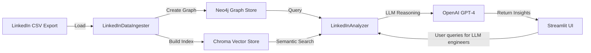

# LinkedIn Network Analyzer

## Overview

This repository provides a fully integrated, end-to-end pipeline to analyze and retrieve insights from your LinkedIn connections using a combination of a Knowledge Graph (Neo4j) and semantic search capabilities (LlamaIndex with vector embeddings). The system allows you to ingest your exported LinkedIn connections data, store and query it via a Neo4j graph database, and perform semantic similarity searches and analyses powered by LlamaIndex and OpenAI embeddings.

The solution is designed for large datasets (e.g., ~22K+ connections) and leverages a retrieval-augmented generation (RAG) pattern to provide rich, context-aware responses. You can use simple text queries like finding all LLM engineers, or more complex, multi-criteria filters.

## Key Features

- **Knowledge Graph with Neo4j**:  
  Represent your LinkedIn network as a graph, linking People, Companies, and other attributes.
  
- **Vector Embeddings & Semantic Search**:  
  Use OpenAI embeddings to enable semantic retrieval. Search for professionals by skill, industry, or text-based queries.
  
- **LLM Integration (OpenAI GPT-4)**:  
  Summarize, rank, and provide detailed insights into profiles, leveraging an LLM for reasoning on top of retrieval results.
  
- **Streamlit UI**:  
  A web-based interface to explore and analyze your connections. Upload your LinkedIn CSV data, query by company, time periods, or search by name.

## Architecture

The system comprises several layers:

1. **Data Ingestion**: Extract data from the LinkedIn connections CSV.
2. **Graph Construction**: Use Neo4j to model the network as nodes (Persons, Companies) and relationships (WORKS_AT).
3. **Vector Indexing**: Convert profile data into embeddings using OpenAI’s embedding models and store them in a Chroma-based vector store.
4. **Analysis & Query**: A `LinkedInAnalyzer` class orchestrates queries to both the KG and the vector index, scoring results and providing relevant profiles.
5. **LLM Reasoning**: The system uses GPT-4 for final summarization and natural language responses.
6. **Streamlit UI**: Offers a user-friendly interface for non-technical users to run queries and view results.

### High-Level Flow Diagram



# LinkedIn Connections Analyzer

## Components

### 1. Data Ingestion (`LinkedInDataIngester`)
**Input:** A CSV file of your LinkedIn connections (`First Name`, `Last Name`, `Company`, `Email`, `URL`, `Connected On`).

**Process:**
- Reads CSV using `pandas`.
- Creates `Document` objects for each connection.
- Inserts `Person` and `Company` nodes into Neo4j via Cypher queries.
- Prepares documents for vector indexing.

**Output:**
- A list of `Document` objects.
- A populated Neo4j graph store.
- A constructed vector index.

### 2. Graph Store (Neo4j)
**Schema:**
- `(Person {name, email, linkedin_url, connected_on})`
- `(Company {name})`
- `(Person)-[:WORKS_AT]->(Company)`

**Use:**
- Filter connections by date ranges, companies, or other metadata.
- Provide a structured backbone before performing semantic filtering.

### 3. Vector Store (Chroma + LlamaIndex)
**Purpose:** Enable semantic queries like “LLM engineer” or “SaaS founder in FinTech”.

**Process:**
- Convert person profiles into embeddings using `OpenAIEmbedding`.
- Store embeddings in a Chroma collection.
- Retrieve candidates by semantic similarity.

### 4. LLM Integration (OpenAI GPT-4)
**Function:**
- Summarize profiles, highlight key attributes.
- Provide human-like explanations and rankings.
- Enhance user queries and results.

### 5. Analyzer (`LinkedInAnalyzer`)
**Query Orchestration:**
- Combines Neo4j queries (exact filters) with vector queries (semantic matches).
- Scores and ranks results.
- Provides endpoints to get detailed profile info and recommend similar contacts.

### 6. Streamlit UI
**Interface:**
- File uploader to load `linkedin_connections.csv`.
- Sidebars for company analysis, time-based filtering, and direct name-based searches.
- Buttons to view detailed profiles and similar connections.

## Setup Instructions

### Prerequisites
- **Python** 3.9+
- **Neo4j** (Community or Enterprise) running locally or remotely.
- **OpenAI API Key**
- A local **Chroma** instance (part of `chromadb`).

### Environment Variables
Define the following in `.streamlit/secrets.toml` or similar:

```toml
OPENAI_API_KEY="your_openai_api_key"
NEO4J_URL="bolt://localhost:7687"
NEO4J_USERNAME="neo4j"
NEO4J_PASSWORD="password"
```

### Installation
```bash
pip install -r requirements.txt
```

### Running Neo4j
Ensure Neo4j is running:
```bash
neo4j start
```

### Running the Application
```bash
streamlit run app.py
```
This will start a local web server at [http://localhost:8501](http://localhost:8501).

## How It Works

### Upload CSV
In the Streamlit UI, upload your LinkedIn CSV (exported from LinkedIn).

### Ingestion & Indexing
The code will:
1. Parse the CSV.
2. Create `Person` and `Company` nodes in Neo4j.
3. Build embeddings for each profile.

### Querying
- **For a query like “Find me all LLM engineers”:**
  1. Uses the vector index to find profiles mentioning LLM-related terms.
  2. Uses the graph store to filter by company, connection date, or other metadata.
  3. Combines results and scores them.
- **LLM Summarization:** The top results are sent to GPT-4 for a coherent, human-friendly summary.

## Extending the System

### New Filters
Add new Cypher conditions in `_build_graph_query` in `LinkedInAnalyzer`.

### More Sophisticated Semantic Search
Enhance `_build_vector_query` to incorporate multiple criteria (e.g., multiple skills, roles, industries).

### Custom Post-Processing
Modify the `SimilarityPostprocessor` or the scoring logic to refine rankings.

## Troubleshooting

### Empty Results
- Check if the CSV is properly formatted.
- Verify if the graph is populated.

### OpenAI Authentication
Ensure `OPENAI_API_KEY` is correctly set.

### Neo4j Connectivity
Verify Neo4j credentials and URL.

## Example Usage

### After Loading Your CSV:
- **Type “Google”** in the Company Analysis panel to see top connections at Google.
- **Check “Profile Search”** for a known contact’s name to get details.
- **Specify a Date Range** in "Connection Timeline" to find recent additions.

You will see relevant results and can drill down into detailed profile views, similar connections, and semantic recommendations.
